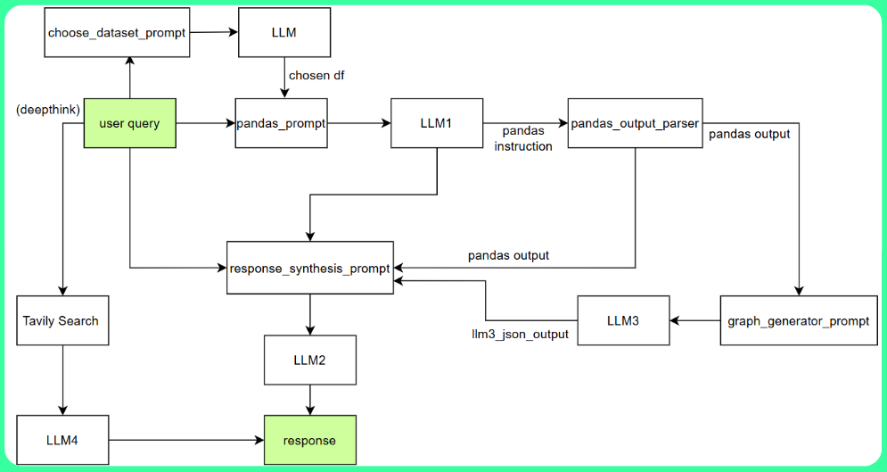

# Big Brain Exception Prototype

## 🚀 Project Overview
Grab MEX AI assistant is a new generation solution that leverages AI to empower Grab's merchant-partners with a smart, intuitive chat-based assistant that is capable of providing actionable insights and proactive guidance directly to merchants, enabling better business decisions and streamlined operations. In addition, our much capable assistant is also able to plot graphs and even perform deep search to provide high quality business insights for Grab's merchant partners. 

## 🎥 Demo
#### Youtube: https://youtu.be/L7SxcbMoi3M?si=btS-NbUMFD0vAdsS  
#### Figma: https://www.figma.com/design/PDGCOUtaZpSNTEonQ17r5G/Grab-MEX-Mobile-User-Interface?node-id=0-1&t=GpcXP3mcMVYZsMnZ-1  
#### Canvas Slides: [https://www.canva.com/design/DAGkWIFg3EM/UpA6N8Lh-dbNzB1NLCBN7w/edit?utm_content=DAGkWIFg3EM&utm_campaign=designshare&utm_medium=link2&utm_source=sharebutton](https://www.canva.com/design/DAGkWIFg3EM/UpA6N8Lh-dbNzB1NLCBN7w/edit?utm_content=DAGkWIFg3EM&utm_campaign=designshare&utm_medium=link2&utm_source=sharebutton)

## ✨ Features
🤖 Query Engine based Chat Assistant  
🎙️ Real-time voice reognition  
🌐 Deep Thinking  
📊 Graph Generation  

## 🏗️ Architecture
Our system employs a multi-LLM architecture to process user queries and generate insightful responses. Here's how it works:



### System Flow
1. **User Query Processing**
   - System receives natural language queries from users
   - Initial query analysis determines the context and intent

2. **Dataset Selection (Gemma-3)**
   - Gemma-3 LLM analyzes the query to select the most appropriate dataset
   - Intelligent mapping between user intent and available data sources

3. **Pandas Query Engine**
   - Converts natural language queries into executable Pandas operations
   - Performs efficient data filtering, aggregation, and transformation
   - Ensures optimal data processing for complex analytical tasks

4. **Data Processing**
   - Executes the generated Pandas operations on selected datasets
   - Handles data cleaning, formatting, and preliminary analysis
   - Prepares data for visualization and response generation

5. **Response Synthesis**
   - Combines processed data with business insights
   - Generates natural language explanations of findings
   - Ensures responses are both informative and actionable

6. **Graph Visualization**
   - Creates dynamic visualizations of analyzed data
   - Supports multiple chart types for optimal data representation
   - Enhances understanding through visual data presentation

## 🧰 Tech Stack
### Frontend
- Streamlit

### Backend
- Python

### ML
- Gemma 3 API
- Tavily API
- LlamaIndex Pandas Query Engine

## 🛠️ Installation
#### 1. Clone the repository
```bash
git clone https://github.com/Marcusng88/Um-Hack-2025-prototype.git
```

#### 2. Create a virtual environment
```bash
python -m venv .venv
.venv/bin/activate
```

#### 3. Install dependencies
```bash
pip install -r requirements.txt
```

#### 4. Creating config.py
1. Copy the contents of `config.eg.py`.
2. Paste the contents into a new file named `config.py` in the same file directory.
3. Create your own Google AI API Key and Tavily API Key.
4. Paste your Google AI API Key into `GOOGLE_API_KEY`.
5. Paste your Tavily API Key into `TAVILY_API_KEY`.

#### 5. Run the code
```bash
streamlit run main.py
```
